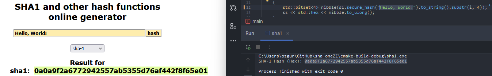

# SHA-1 C++ Implementation

A simple C++ implementation of the SHA-1 (Secure Hash Algorithm 1). This project is primarily for educational purposes to understand the inner workings of the SHA-1 hashing algorithm.

## ⚠️ Security Notice

**SHA-1 is considered cryptographically insecure and should not be used for new security-sensitive applications.** Collisions have been demonstrated, meaning different inputs can produce the same hash. This implementation is for learning and demonstration purposes only. For new projects requiring secure hashing, please use SHA-256, SHA-3, or other modern, secure algorithms.

## Output Instance



## Features

*   **Message Padding:** Implements the standard SHA-1 padding scheme.
*   **Message Block Processing:** Splits the padded message into 512-bit blocks.
*   **Word Expansion:** Expands 16 32-bit words from a block into 80 32-bit words.
*   **Compression Function:** Applies the 80-round SHA-1 compression function.
*   **Output:** Generates a 160-bit hash value.

## How it Works

1.  **Preprocessing:**
    *   The input message is converted to a bit string.
    *   Padding bits are appended: a '1' bit, followed by '0' bits until the message length is 448 (mod 512).
    *   The original message length (as a 64-bit big-endian integer) is appended.
2.  **Processing in 512-bit Blocks:**
    *   The padded message is divided into 512-bit blocks.
    *   For each block:
        *   The block is broken into sixteen 32-bit words (W[0] to W[15]).
        *   These are extended into eighty 32-bit words (W[0] to W[79]) using the SHA-1 schedule:
            `W[i] = (W[i-3] XOR W[i-8] XOR W[i-14] XOR W[i-16]) <<< 1` for `i >= 16`.
        *   Five hash values (H0-H4) are initialized (or taken from the previous block's result).
        *   An 80-round main loop is executed, updating five working variables (a, b, c, d, e) based on the current H values, round constants (K), round-specific functions (f), and W[i].
        *   The hash values (H0-H4) are updated by adding the working variables.
3.  **Output:**
    *   The final hash value is the concatenation of H0, H1, H2, H3, and H4.

## Building and Running

You'll need a C++ compiler (like g++).

```bash
# Compile the source files
g++ *.cpp -o sha_one -std=c++17

# Run the executable
./sha_one
